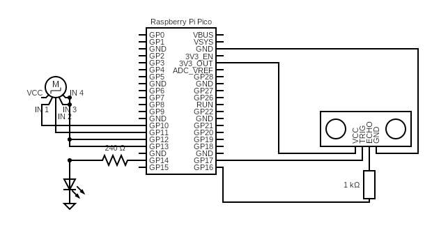

# Home Automation System with Raspberry Pi Pico

A smart home automation system built using Raspberry Pi Pico that controls door access with a stepper motor and provides visual feedback using LED indicator.

## 🚀 Features

- **Smart Door Control**: Automated door opening/closing using stepper motor
- **LED Status Indicators**: Visual feedback for door opening action
- **MicroPython Based**: Lightweight and efficient firmware
- **Customizable**: Easy to modify and extend functionality

## 📋 Hardware Components

| Component | Quantity | Purpose |
|-----------|----------|---------|
| Raspberry Pi Pico| 1 | Main controller |
| Stepper Motor (28BYJ-48) | 1 | Door opening mechanism |
| ULN2003 Driver Board | 1 | Stepper motor driver |
| LED Light | 1 | Status indicator |
| Distance Sensor(HC-SR04) | 1 | Measure distance to open/close door and turn light on/off |
| Jumper Wires | Multiple | Connections |
| Breadboard | 1 | Prototyping |
| Power Supply | 1 | 5V for motor, 3.3V for Pico |

## 🔌 Circuit Diagram

## 🔧 Setup Instructions
### 1. Hardware Connections
Ultrasonic Sensor:

VCC → 5V

GND → GND

TRIG → GPIO 17

ECHO → GPIO 16

Stepper Motor (ULN2003 Driver):

IN1 → GPIO 10

IN2 → GPIO 11

IN3 → GPIO 12

IN4 → GPIO 13

Power → External 5V-12V supply

LED:

Anode → GPIO 14 (with current-limiting resistor(240 ohm used here))

Cathode → GND

### 2. Software Installation
1. Install Thonny IDE on your computer

2. Install MicroPython on Raspberry Pi Pico

3. Connect Pico to computer via USB

4. Open automation_door&light.py in Thonny

Upload to Pico as main.py to run this script as soon as you plug in your pico. 
Or upload with any other name(eg. automation.py) and run script manually with thonny

### 🚀 How to Use
1. Upload the code to Raspberry Pi Pico as main.py 

2. Connect all hardware components as specified

3. Power the system

The system will automatically:

i. Monitor distance using ultrasonic sensor

ii. pen door and turn on LED when object < 50cm detected

iii. Close door and turn off LED when object moves away

iv. Print distance readings and status messages to console

### ⚙️ Configuration
You can modify these constants in the code:

DISTANCE_THRESHOLD = 50  # Detection distance in cm

STEP_DELAY = 2           # Motor step delay in milliseconds

STEPS_PER_REVOLUTION = 1024  # Number of steps of stepper motor for full door operation

### 🔄 Operation Flow
Initialization: System starts with door closed and LED off

Distance Measurement: Continuous monitoring via ultrasonic sensor

Object Detection: When distance < 50cm, system activates

Door Opening: Stepper motor rotates to open door, LED turns on

Door Closing: When object moves away (>50cm), door closes, LED turns off

Error Handling: Automatic motor stop and LED off on errors

### 🛠 Troubleshooting
Sensor not reading: Check TRIG/ECHO connections and power supply

Motor not moving: Verify stepper driver connections and external power

LED not lighting: Check GPIO 14 connection and resistor

Program crashes: Monitor Thonny console for error messages

### 📝 Notes
Ensure stepper motor has adequate power supply (not from Pico's 3.3V, use external battery of 5-12V)

Adjust DISTANCE_THRESHOLD for different detection ranges

Modify STEP_DELAY for faster/slower motor movement

The system uses half-step sequence for smoother motor operation

### 🎯 Applications
1. Automated doors for small projects

2. Security systems

3. Smart home automation

4. Educational robotics projects

Developed with MicroPython on Raspberry Pi Pico

